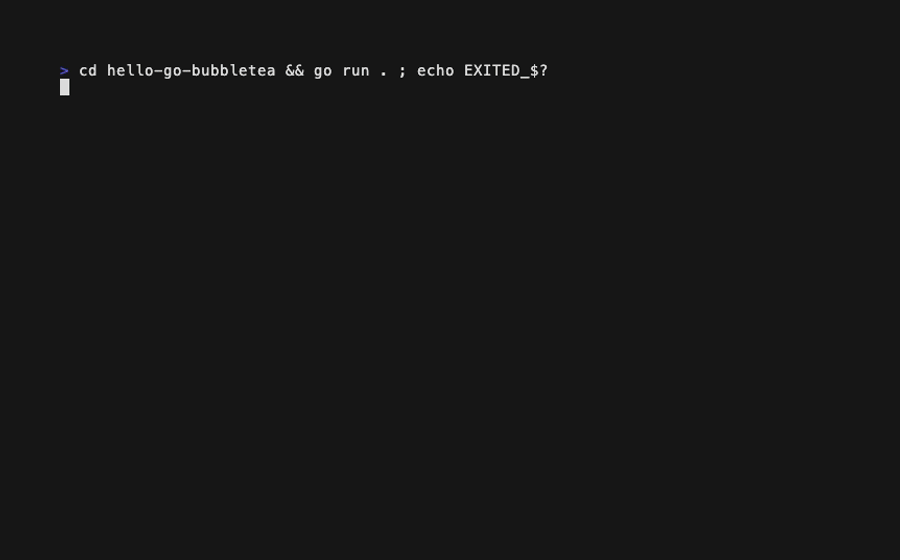
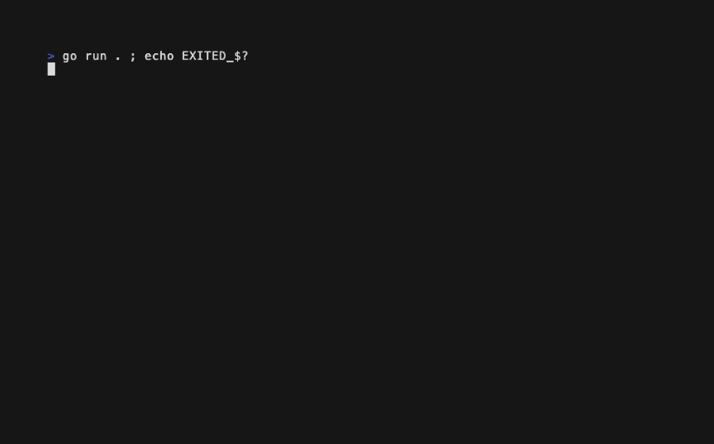

# Fable-5 — hello-go-bubbletea

Results for locally hosted model `Fable-5` on the `hello-go-bubbletea` test.

> Build a "Hello, World!" app in Go using `charmbracelet/bubbletea`, with creative
> flair (animation, color, interactivity); the one strict requirement is that
> pressing `q` must always quit.

| Run | Builds | Runs | Meets requirements | Score | Notes |
|-----|--------|------|--------------------|-------|-------|
| 1   | ✅     | ✅   | ✅                 | 10/10 | Block-letter rainbow banner with confetti and party mode |
| 2   | ✅     | ✅   | ✅                 | 10/10 | Sine-wave greeting with sparkles, themes, and pause |
| 3   | ✅     | ✅   | ✅                 | 10/10 | Starfield with confetti bursts and 18 languages, runewidth-aware |
| 4   | ✅     | ✅   | ✅                 | 10/10 | Wave greeting over starfield with confetti and pause |

**Average score: 10.0/10**

## Run 1

The model built a 30 fps TUI that renders "HELLO, WORLD!" in a hand-drawn 5-row
block font, with each column riding a sine wave under a scrolling rainbow, over
falling confetti; space toggles a faster "party mode" and enter/arrows cycle
through 12 languages. It builds and runs cleanly as delivered, `q` (and
ctrl+c) quits, and it prints "Goodbye, World! 👋" on exit. The code is
idiomatic Bubble Tea (immutable model, tick commands, cell-grid renderer) with
a correct hand-rolled HSL→hex converter and no stray dependencies.
Score: 3 + 2 + 3 + 2 = 10/10

## Run 2

Delivered as a nested `hello-go-bubbletea/` project with its own README: the
greeting rides a rainbow sine wave over twinkling sparkles, with enter cycling
9 languages, tab cycling 4 color themes (rainbow/ocean/sunset/neon), and space
freezing time. Builds and runs cleanly; `q`, esc, and ctrl+c all quit. Notable
quality touch: the grid renderer batches unstyled cells so escape codes aren't
emitted per blank character, and it degrades gracefully on tiny terminals.
Score: 3 + 2 + 3 + 2 = 10/10

## Run 3

A bouncing rainbow greeting over a twinkling starfield with radial confetti
bursts (enter) and 18 languages including Japanese, Chinese, Arabic, and Thai —
and it correctly pulls in `mattn/go-runewidth` to handle double-width CJK
glyphs so rows stay aligned, the only run in the whole batch to consider this.
Builds and runs cleanly; `q` quits. The canvas `put()` helper that claims the
trailing cell of double-width runes is a genuinely careful detail.
Score: 3 + 2 + 3 + 2 = 10/10

## Run 4

"hello-wave": the greeting rides a rainbow sine wave over a starfield, with
space firing gravity-affected confetti, ←/→ cycling 8 languages, and p pausing.
Builds and runs cleanly; `q`, esc, and ctrl+c quit. The renderer batches runs
of identically-styled cells before invoking lipgloss — an efficiency touch the
comments call out — and the code is clean throughout. Conceptually it overlaps
heavily with runs 2 and 3 (wave + starfield + confetti), so the four runs are
polished variations on one theme rather than four distinct ideas.
Score: 3 + 2 + 3 + 2 = 10/10
