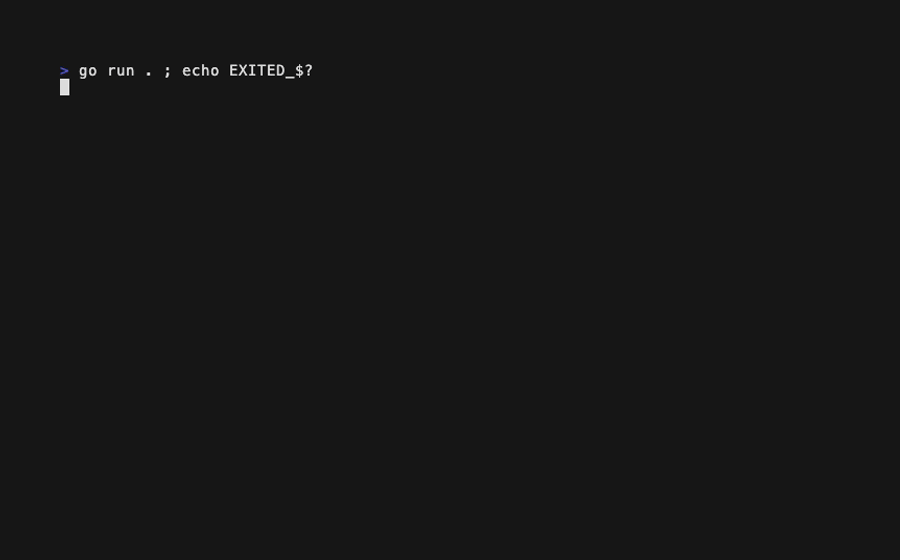

# Qwen3-Coder-Next-UD-Q4_K_M

Results for locally hosted model `Qwen3-Coder-Next-UD-Q4_K_M`.

## hello-go-bubbletea

> Build a "Hello, World!" app in Go using `charmbracelet/bubbletea`, with creative
> flair (animation, color, interactivity); the one strict requirement is that
> pressing `q` must always quit.

| Run | Builds | Runs | Meets requirements | Score | Notes |
|-----|--------|------|--------------------|-------|-------|
| 1   | ✅     | ✅   | ❌                 | 6/10  | Runs, but `q` (and ctrl+c) fails to quit — process must be killed |
| 2   | ❌     | —    | —                  | 0/10  | Hallucinated go.mod deps and nonexistent lipgloss API; does not build |
| 3   | ✅     | ✅   | ✅                 | 7/10  | `q` quits, but the title text is invisible (fg ≈ bg color bug) |
| 4   | ✅     | ✅   | ✅                 | 8/10  | Works and quits, but its "rotating" animation is dead code |

**Average score: 5.3/10**

### Run 1


A gradient "Hello, World!" behind a loading-spinner intro screen, wrapped in a
rounded border. It builds cleanly and starts, but the border box is sized to
the full terminal and overflows both edges, and in inline (non-altscreen) mode
the repaints flood the scrollback. Critically, **`q` does not quit**: keyboard
input works (enter switches screens), but after `q` — or even ctrl+c — the
program keeps rendering until killed externally, likely tied to its
ticker/context command plumbing. The `"space"` key case also never fires
(Bubble Tea reports space as `" "`), and the `tilt`/`bounce` fields are
computed but never used.
Score: 3 + 1 + 2 + 0 = 6/10

### Run 2

```text
$ go build .
go: github.com/charmbracelet/color@v0.4.0: repository 'https://github.com/charmbracelet/color/' not found

# after replacing the hallucinated go.mod with a clean one:
./main.go:79:19: not enough arguments in call to tea.Tick
	have (number)
	want (time.Duration, func(time.Time) tea.Msg)
./main.go:102:3: lipgloss.NewStyle().FontSize undefined (type lipgloss.Style has no field or method FontSize)
./main.go:116:2: declared and not used: statusStyle
```

Does not build. The delivered `go.mod` requires several hallucinated modules
(`charmbracelet/color`, `muesli/flow`, `sahilm/fancy`), so `go mod tidy`
cannot even resolve dependencies; and a test compile against a clean module
shows the source itself calls a nonexistent `lipgloss` `FontSize` method,
mis-calls `tea.Tick`, and leaves an unused variable. No `go.sum` was provided.
Score: 0 + 0 + 0 + 0 = 0/10

### Run 3



A bordered card with an animated dots spinner and "Press q to quit" hint;
builds cleanly, runs, and `q` quits promptly. The centerpiece is broken,
though: "Hello, World!" renders as a solid red rectangle because the
foreground and background come from a mathematically wrong `hueToRGB` (the
blue channel ignores the hue entirely), making the text unreadable — and the
`frame` counter that should rotate the gradient is never incremented, so even
the intended animation is static. The `quitting` flag and its empty-View
branch are dead weight.
Score: 3 + 1 + 3 + 0 = 7/10

### Run 4


A rainbow bar, animated spinner, and a boxed "Hello, World! 🚀" with a quit
hint; builds cleanly, displays without visible errors, and `q` quits. Under
the hood the flagship feature is dead: `Tick()` mutates a *copy* of the model
in its closure, so `rotation` and `frame` never change and the box that was
meant to orbit the screen sits still; it also fabricates `spinner.TickMsg{}`
values by hand instead of using the spinner's own tick command, and `quitting`
is never set. The spinner only animates by luck (a zero message ID passes the
bubbles ID check).
Score: 3 + 2 + 3 + 0 = 8/10

## pr-review

> Review six PRs against a Bubble Tea app (two real fixes, two working-but-
> suboptimal, two that compile and run with genuine bugs) and write a
> structured verdict-plus-findings review to `results.md`.

| Run | Verdicts OK | Caught PR 3 | Caught PR 6 | Score | Notes |
|-----|-------------|-------------|-------------|-------|-------|
| 1   | ❌          | ✅          | ✅          | 5/10  | Four verdict misses; PR 5 read backwards |
| 2   | ❌          | ❌          | ✅          | 6/10  | Phantom compile errors; misses PR 3's dead field |
| 3   | ❌          | ✅          | ❌          | 3/10  | Approves PR 6 while hallucinating a behavior change |
| 4   | ❌          | ✅          | ❌          | 5/10  | Approves PR 6 with no findings at all |

**Average score: 4.8/10**

### Run 1

Both planted bugs are identified — PR 3's unused `spinSpeed` (twice, once
misattributed to `renderSpin`) and PR 6's range-copy — but PR 6's blocking bug
is filed as a mere suggestion under an APPROVE WITH SUGGESTIONS verdict. Four
verdicts miss: PR 1 is rejected with a confused claim that the sleep "doesn't
actually cap the frame rate" (it does), PR 4 is rejected for a missing
`rand.Seed` (unneeded since Go 1.20), and PR 5's clamp is read exactly
backwards — the review claims it cuts the header and keeps the footer. It also
invents a missing-`time`-import compile error in PR 2 despite the prompt
stating every PR compiles.
Score: 0 + 4 + 1 + 0 = 5/10

### Run 2

The best of this model's four, but still shaky. PR 6's range-copy bug is
caught cleanly with the right fix, and PR 5's dropped footer is spotted
(though the review then wrongly insists the header is still broken). PR 3's
actual bug is missed entirely, replaced by an invented story about `spinSpeed`
"starting at 0" (main initializes it to 0.05), and PR 4 is rejected on a
phantom compile error — claiming `time.Now()` is still used after the import
removal — plus the `rand.Seed` demand.
Score: 2 + 2 + 2 + 0 = 6/10

### Run 3

The weakest run of the whole batch. PR 6 gets APPROVE WITH SUGGESTIONS while
the review hallucinates that the moved loop makes colors "cycle over time"
(a behavior change that doesn't exist) and never notices the range-copy bug
that actually breaks the animation. PR 1 gets a plain APPROVE with no
`tea.Tick` suggestion, PR 4 is rejected for seeding again, and the PR 3
finding — though it does land on the hardcoded `0.05` — is wrapped in visible
stream-of-consciousness ("Wait, looking more carefully… Let me re-check")
left in the final review. PR 5's footer loss is caught.
Score: 0 + 2 + 1 + 0 = 3/10

### Run 4

PR 3's dead field is caught and PR 5's bottom-truncation is identified, but
PR 1 is rejected with a nonsensical theory that sleeping "before the return"
fails to throttle, and PR 6 — the run's fatal miss — is approved with
literally no findings, praising the refactor while the rain animation it
reviews is completely broken.
Score: 1 + 2 + 2 + 0 = 5/10

## Overall

**Overall average score: 5.1/10** (hello-go-bubbletea 5.3, pr-review 4.8)
