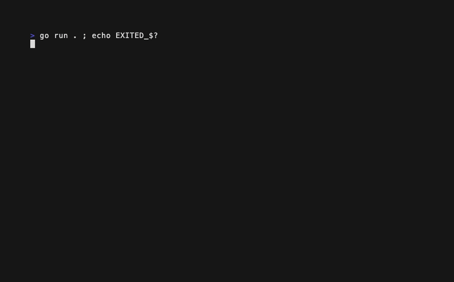

# Qwen3.6-35B-A3B

Results for locally hosted model `Qwen3.6-35B-A3B`.

## hello-go-bubbletea

> Build a "Hello, World!" app in Go using `charmbracelet/bubbletea`, with creative
> flair (animation, color, interactivity); the one strict requirement is that
> pressing `q` must always quit.

| Run | Builds | Runs | Meets requirements | Score | Notes |
|-----|--------|------|--------------------|-------|-------|
| 1   | ✅     | ✅   | ✅                 | 7/10  | Four animation modes; `q` quits, but layout overflows and it busy-loops the CPU |
| 2   | ✅     | ✅   | ✅                 | 8/10  | Bouncing boxed greeting; works, with a box-border rendering artifact |
| 3   | ✅     | ❌   | ❌                 | 5/10  | Panics at startup: `strings.Repeat` with negative count in View |
| 4   | ✅     | ✅   | ✅                 | 9/10  | Bouncing bubble with particle bursts; works, some dead code |

**Average score: 7.3/10**

### Run 1



The most ambitious run of the batch: space cycles four animation modes (wave,
rain, spin, pulse), and the spin mode — the greeting orbiting in a rotating
ring of colored letters — is genuinely striking. It builds and runs, and `q`
quits cleanly. But the View emits more lines than the terminal has, so the
header with the controls is pushed off-screen, and its "ticker" command
returns a message immediately with no delay, making the event loop a
CPU-pegging busy loop. Rain positions are mutated inside `View()`, and the
"random" helper is just the current millisecond modulo n, so values correlate.
Score: 3 + 1 + 3 + 0 = 7/10

### Run 2


A rainbow-bordered box containing a rainbow "Hello, World!" bounces around the
screen, steerable with the arrow keys, with a pause toggle, a status light,
and a decorative gradient progress bar. Builds and runs; `q` and ctrl+c quit.
The box is positioned by prefixing spaces to only the first of its three
lines, so a detached piece of border floats at the box's x-offset while the
rest hugs the left margin — a visible artifact — and centering uses `len()` on
ANSI-styled strings, so alignment drifts. Amusingly, it imports the `progress`
bubble yet hand-rolls everything else.
Score: 3 + 1 + 3 + 1 = 8/10

### Run 3

```text
Caught panic:

goroutine 1 [running]:
...
strings.Repeat({...}, 0x0?)
        .../strings/strings.go:628
main.(*model).View(0x14000160000)
        .../Qwen3.6-35B-A3B/hello-go-bubbletea/3/main.go:239
```

Builds cleanly but crashes at startup, reproducibly: `View()` runs before the
first `WindowSizeMsg` arrives, so `strings.Repeat("─", min(m.width-2, 80))`
is called with a negative count and panics. The design on paper — a starfield
with a typewriter reveal, per-character bobbing, wind control, and emoji
particle bursts — is the most creative of this model's four runs, but none of
it can be seen, and the strict `q`-quits requirement can't be satisfied by a
program that dies before accepting input. No GIF was recorded per the
crash-at-startup rule.
Score: 3 + 0 + 2 + 0 = 5/10

### Run 4


A bubble (🫧) drifts and bounces around a tinted background while a tri-color
"Hello, World!" sits center-screen; space fires emoji particle bursts with a
screen-shake, WASD/arrows steer, r resets, and a spinner animates in the
footer. Builds and runs without visible errors, and `q` quits (though ctrl+c
is notably not bound — only `q`/esc). Quality is middling: it hand-rolls raw
ANSI escape codes alongside lipgloss, the `greetingPhase`/`entranceProgress`/
`maxLife` fields are dead, and `intMax`/`intMin` reimplement builtins.
Score: 3 + 2 + 3 + 1 = 9/10

## pr-review

> Review six PRs against a Bubble Tea app (two real fixes, two working-but-
> suboptimal, two that compile and run with genuine bugs) and write a
> structured verdict-plus-findings review to `results.md`.

| Run | Verdicts OK | Caught PR 3 | Caught PR 6 | Score | Notes |
|-----|-------------|-------------|-------------|-------|-------|
| 1   | ❌          | ✅          | ✅          | 8/10  | Both bugs caught; demands `rand.Seed` on PR 4 |
| 2   | ❌          | ❌          | ✅          | 6/10  | Approves PR 3's dead feature outright |
| 3   | ✅          | ✅          | ✅          | 9/10  | Best run; invents a `rand.Default.Intn` API |
| 4   | ❌          | ✅          | ❌          | 5/10  | Falls for both anticipated wrong claims |

**Average score: 7.0/10**

### Run 1

A strong review: both planted bugs are caught with the mechanism named and the
right fix, and both improvement catches land (`tea.Tick` on PR 1, the dropped
footer on PR 5). The one verdict miss is PR 4, rejected for lacking an
explicit `rand.Seed` — unnecessary on the auto-seeded Go 1.20+ toolchain.
Precision suffers from side claims: that Wave/Pulse render "exactly four
lines" and never overflow (all modes emit `m.height` rows), a bogus warning
that the `range` loop's shadowed `i` "could cause a compile error", and a
wrong assertion that `main`'s initializer is redundant because reset runs
first.
Score: 2 + 4 + 2 + 0 = 8/10

### Run 2

Catches PR 6's range-copy bug cleanly, but approves PR 3 outright — even
praising its "well-defined starting value" — missing that `spinSpeed` is
never read and the feature is dead. On PR 5 it correctly notes the footer is
dropped (earning the catch) but then claims the header "may still be pushed
off-screen", which is the one problem the clamp actually does fix.
Score: 2 + 2 + 2 + 0 = 6/10

### Run 3

The best local-model run of the batch: every verdict in the acceptable range,
both bugs caught with fixes, both improvements flagged. The only cost is
precision: it recommends a nonexistent `rand.Default.Intn(max)` as "the
idiomatic form" on Go 1.22+, and claims a raw sleep "bypasses Bubble Tea's
tick bookkeeping", which is invented framework behavior.
Score: 3 + 4 + 2 + 0 = 9/10

### Run 4

Falls into both traps the corpus plants: PR 1 is rejected with the claim that
`time.Sleep` in a command "freezes the entire terminal" (commands run in their
own goroutine — the exact hallucination the answer key anticipates), and PR 6
is approved by inventing a write-back (`m.rainPos[i] = c`) that appears
nowhere in the diff, thereby missing the range-copy bug. PR 3's dead field and
PR 5's footer loss are still caught.
Score: 1 + 2 + 2 + 0 = 5/10

## Overall

**Overall average score: 7.2/10** (hello-go-bubbletea 7.3, pr-review 7.0)
