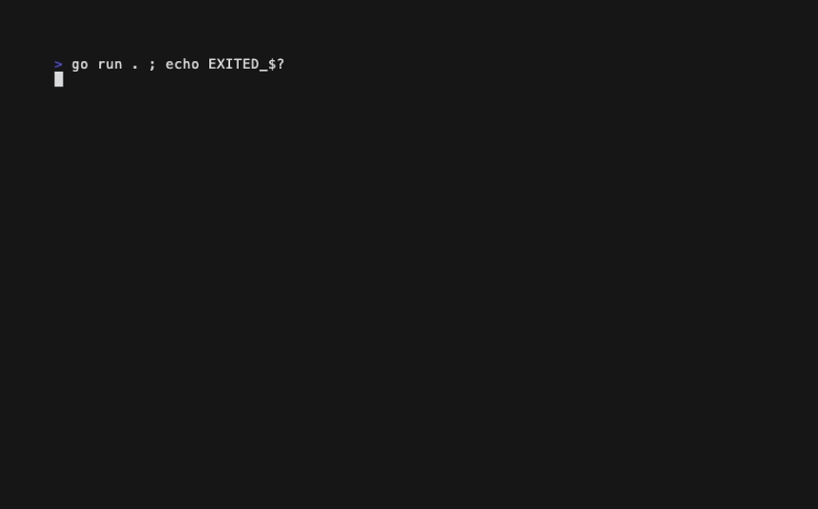

# gpt-oss-120b-GGUF — hello-go-bubbletea

Results for locally hosted model `gpt-oss-120b-GGUF` on the `hello-go-bubbletea` test.

> Build a "Hello, World!" app in Go using `charmbracelet/bubbletea`, with creative
> flair (animation, color, interactivity); the one strict requirement is that
> pressing `q` must always quit.

| Run | Builds | Runs | Meets requirements | Score | Notes |
|-----|--------|------|--------------------|-------|-------|
| 1   | ✅     | ✅   | ⚠️                 | 6/10  | Spinner never animates (message routing bug); wrote its files to the repo root |
| 2   | ✅     | ✅   | ⚠️                 | 8/10  | Animated braille spinner; first claimed run 1's files as its own work |
| 3   | ❌     | ❌   | ❌                 | 0/10  | DNF: `go.mod` requires nonexistent `bubbletea/v2 v2.9.0` |
| 4   | ✅     | ✅   | ⚠️                 | 8/10  | Color-cycling greeting in a bordered box; needed prompts to write the file and `go.mod` |

**Average score: 5.5/10**

**Prompting notes.** **Every run needed additional prompting** beyond
`prompt.md`. The prompt itself also changed during the series: after
run 1 wrote its output outside its run directory, runs 2–4 were given a
revised prompt beginning "Within our current directory, …". Code is scored as
finally delivered. Where a run needed a follow-up prompt to satisfy something
the prompt asked for (working inside its directory, providing "anything else
needed to build and run it"), 1 point is deducted from Meets requirements; ⚠️
marks those runs. `q` quit correctly in every run that built.

## Run 1


A single-line greeting with a `bubbles/spinner` (Points style, pink) in front
of it. It was given the original prompt, with no directory instruction, and
created a subdirectory at the root of the git repository instead of working
in its run directory; the files were moved here afterwards. It needed
additional prompting to complete. The delivered program builds and `q` exits
cleanly (status 0). But its "forward all messages to the spinner" block sits
inside the `case tea.KeyMsg:` branch, so the spinner's tick messages fall
through to `return m, nil` and the spinner never moves; the GIF shows the same
frame throughout. It also uses the deprecated `p.Start()` and isn't gofmt'd.
Score: 3 + 1 + 2 + 0 = 6/10

## Run 2


At first the model found run 1's files and simply reported the task as
already done; it had to be told it hadn't followed the instructions before it
produced its own program. The result is a hand-rolled braille spinner driven
by a self-rescheduling `tea.Tick`, followed by a bold cyan "Hello, World!"
with a red-highlighted `q` in the hint. The tick loop is correct and the
animation runs smoothly. `q` (and `Q`) quit cleanly, though ctrl+c isn't
bound. It pins bubbletea v0.23.0 and lipgloss v0.10.0, both years out of
date; it uses the deprecated `p.Start()`; and the file isn't gofmt'd
(4-space indentation).
Score: 3 + 2 + 2 + 1 = 8/10

## Run 3

```text
$ go build
main.go:7:5: github.com/charmbracelet/bubbletea/v2@v2.9.0: missing go.sum entry for go.mod file
$ go mod tidy
go: hello-go-bubbletea imports
	github.com/charmbracelet/bubbletea: github.com/charmbracelet/bubbletea/v2@v2.9.0:
	reading github.com/charmbracelet/bubbletea/go.mod at revision v2.9.0: unknown revision v2.9.0
```

**DNF:** it was repeatedly told its dependencies were failing and never
resolved them, so the tester stopped the run. The `go.mod` requires a
hallucinated version (`bubbletea/v2 v2.9.0`) of a module path the code
doesn't even import: `main.go` imports the v1 path
`github.com/charmbracelet/bubbletea`, and lipgloss is imported but never
required. `go mod tidy` can't recover it. The code itself is a static,
styled "Hello, World! Press 'q' to quit." with no animation or
interactivity, so it would have been the least creative run even if it had
built. No GIF was recorded.
Score: 0 (build fails; capped per rubric) = 0/10

## Run 4



It worked in the correct directory from the start, but needed one extra
prompt to actually write the source file and another to create `go.mod`. The
program shows "Hello, World!" inside a rounded, teal-bordered blue box and
cycles the greeting through five colors on a 500 ms `tea.Tick`, with the tick
loop implemented correctly. `q` exits cleanly (ctrl+c isn't bound). The code
is small and clean apart from the deprecated `p.Start()`, missing gofmt
formatting, and a color slice rebuilt on every `View()`. It's a modest take
on "make it fun", but it all works.
Score: 3 + 2 + 2 + 1 = 8/10
